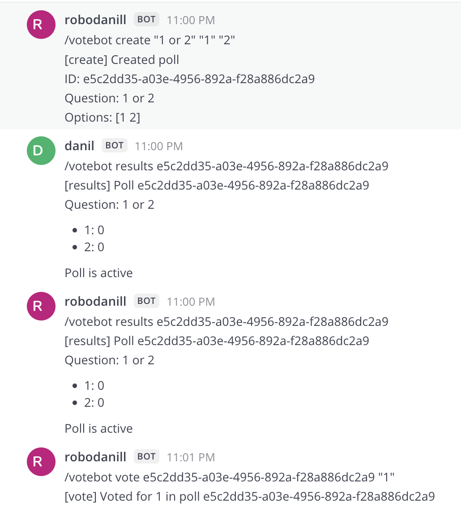
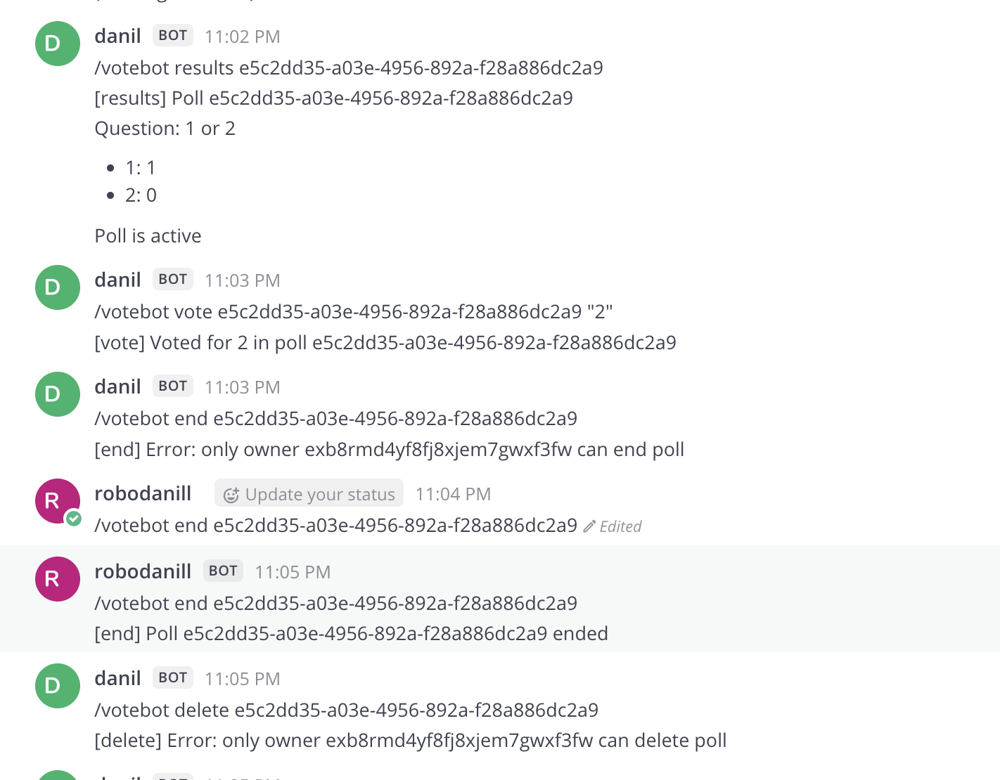
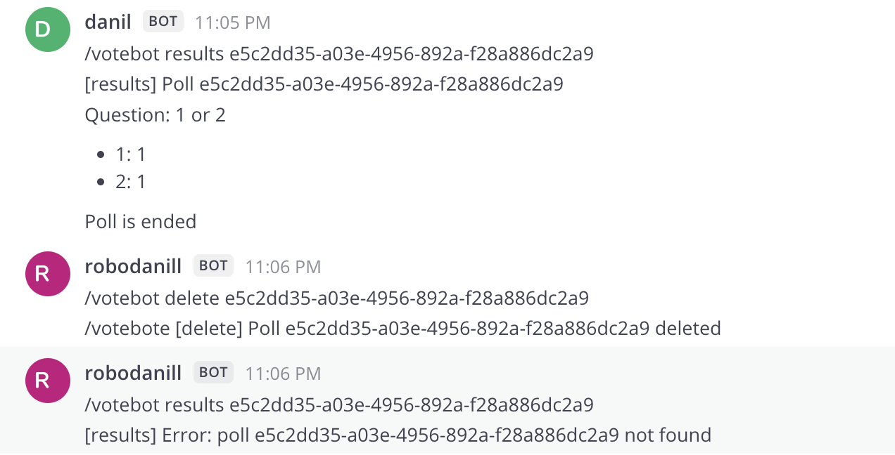

### Инструкция: 
1. Склонировать и перейти в репозиторий
```
git clone https://github.com/robodanill/vote-bot.git
cd vote-bot
```
2. Развернуть mattermost (если вдруг нет своего). Будет доступен на порте 8065 localhost
```
docker-compose up -d
```
3. Перейти http://localhost:8065
* Зарегистрироваться, создать организацию от администратора и настроить, для этого в левом верхнем меню Integrations -> Slash Commands -> Add Slash Command. 
* Command Trigger Word: votebot. Request URL - адрес, где развернут сервис. http://<Адрес машины>:8081/command. Title: Vote Bot. Response Username: VoteBot
* Сохранить полученный Токен. 
4. Перейти в рабочую директорию для запуска бота. 
``` 
cd bot
```
* В docker-compose.yaml установить MATTERMOST_TOKEN значению, полученному на прошлом шаге.
```
go mod tidy
docker-compose up -d
```
5. Протестировать. Для этого в чате можно выполнить запросы, аналогично тем, что на скрине. Robodanill (далее r) - аккаунт владелец опроса, danil (далее d) - другой участник чата.



* Видим, что опрос создан, все могут просмотреть его результаты. r проголосовал за 1.



* d проверил результаты (что обновлены) и проголосовал сам.
* d попытался завершить опрос - не вышло. 
* r завершил опрос (тк создатель). 
* d пытался удалить уже завершенный опрос - не вышло. 



* d решил проверить, что опрос еще существует - действительно. 
* r удалил опрос и проверил, что его действительно не существует.
